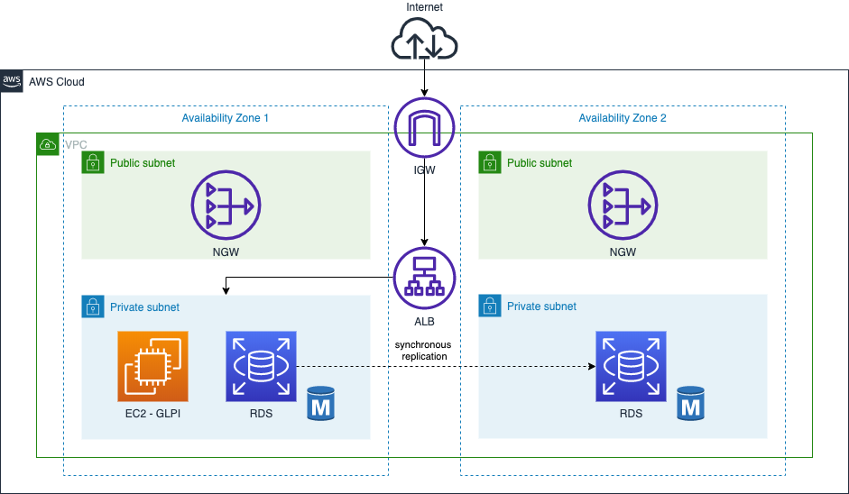

# GLPI on RDS High Availability

The purpose of this CloudFormation template creates a high availability setup for GLPI using an EC2 instance, an RDS MariaDB instance and a shell script installing GLPI on a Linux server.

This README file provides a comprehensive guide on how to install and configure GLPI on an Ubuntu-based 20.04 system. I hope it helps you get started with using GLPI for your IT asset management needs.

## Key Components

- EC2 instance: This is the instance where GLPI will be installed.
- RDS Subnet Group: This is a group of private subnets for RDS.
- EC2 Instance Security Group: This is a security group that allows inbound traffic from ALB to the EC2 instance.
- Instance Security Group Ingress: This is an ingress rule for the EC2 instance security group.
- RDS instance: This is the RDS MariaDB instance that will store GLPI data.
- Load Balancer: This is the Internet-facing ELB that balances incoming traffic to the EC2 instance.
- Load Balancer Security Group: This is the security group for the load balancer that allows inbound traffic from the Internet.
- Target Group: This is the target group for the ELB that routes incoming traffic to the EC2 instance.
- Listener: This is the listener for the ELB that forwards incoming traffic to the target group.

## Parameters

The following parameters must be passed to the CloudFormation template:

- PublicSubnetA: ID of the first public subnet.
- PublicSubnetB: ID of the second public subnet.
- PrivateSubnetA: ID of the first private subnet.
- PrivateSubnetB: ID of the second private subnet.
- InternetGateway: ID of the Internet Gateway.
- VPC: ID of the Virtual Private Cloud.
- EC2InstanceType: EC2 instance type. Allowed values are: t2.micro, t2.small, t2.medium, and t2.large.
- EC2InstanceProfile: EC2 instance profile for Systems Manager.
- KeyPair: EC2 key pair name.

## Usage

1. Open the AWS CloudFormation console.
1. Create a new stack and upload the `stack.yml` file.
1. Retrieve the endpoint from the database in the outputs.
1. Open the `install.sh` file, edit the export variables.
1. Connect to the EC2 and run the installation script.

## Access GLPI

You should now be able to access to the GLPI web application by accessing your ALB's IP address in your web browser. The GLPI setup wizard should appear, allowing you to complete the setup process and enjoy.

- MySQL server: `<RDS ENDPOINT>`
- MySQL user: `user`
- MySQL password: `MySuperGlpi2022`

[Install wizard](https://glpi-install.readthedocs.io/en/latest/install/wizard.html)

## Note

The CloudFormation template has a condition that checks if the region is us-east-1. If it is, the private subnet A is used for the EC2 instance, otherwise private subnet B is used.

## Security

See [CONTRIBUTING](CONTRIBUTING.md#security-issue-notifications) for more information.

## License

This library is licensed under the MIT-0 License. See the LICENSE file.